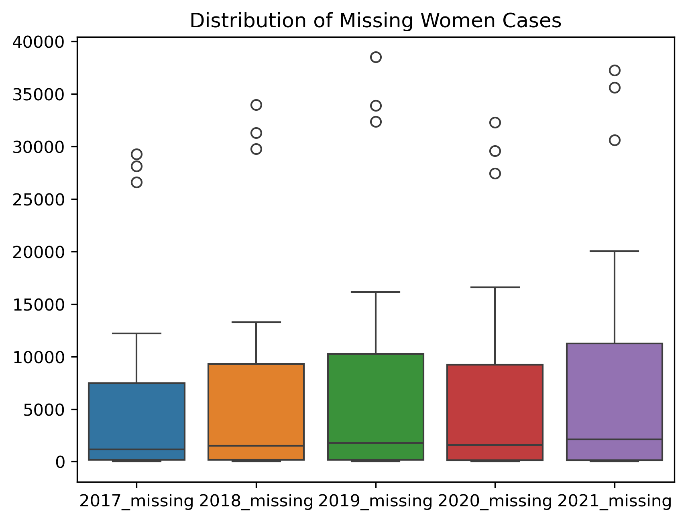

# 📊 Missing Women Analysis (India)

## 📌 Project Overview

This project analyzes **Missing and Traced Women Cases in India (2017–2021)** using data analysis and visualization techniques. The goal is to identify **trends, patterns, and state-wise variations** in the data.

---

## 🎯 Objectives

* Analyze **year-wise trends** in missing and traced cases
* Compare **missing vs traced women cases**
* Identify **state-wise patterns and variations**
* Perform **exploratory data analysis (EDA)** using visualizations

---

## 🗂️ Dataset

* Covers **States/UTs in India**
* Time period: **2017–2021**
* Includes:

  * Missing women cases
  * Traced women cases

---

## 🛠️ Tools & Technologies

* Python
* Pandas
* Matplotlib
* Seaborn
* Jupyter Notebook

---

## 📊 Analysis Performed

* Data Cleaning & Preprocessing
* Exploratory Data Analysis (EDA)
* Trend Analysis (Line Charts)
* Comparative Analysis (Bar Charts)
* State-wise Analysis
* Distribution & Pattern Detection (Box Plot, Pie Chart, Heatmap)

---

## 📁 Project Structure

📦 Missing-Women-Analysis
┣ 📜 Missing_Women.ipynb
┣ 📜 Missing_Women_Analysis.csv
┗ 📜 README.md

---

## ▶️ How to Run

1. Clone the repository
   git clone <your-repo-link>

2. Open the notebook
   jupyter notebook

3. Run all cells to view analysis

---

## 📌 Note

Detailed insights, interpretations, and conclusions are included inside the **Jupyter Notebook**.

---
---
## 📊 Visualizations & Insights

### 📈 National Trends

*Figure 1: Comparison of Missing vs. Traced cases across India (2017-2021). The data shows a consistent trend in reporting and recovery.*

### 🗺️ State-wise Impact

*Figure 2: Grouped analysis showing the volume of cases per State/UT. This highlights which regions require more focused resources.*

<b>View All 12 Analysis Charts (Detailed EDA) 📂</b>

#### Recovery Proportions

*Distribution of successfully traced vs. missing cases.*

#### Statistical Distributions

#### Correlation & Patterns

#### Advanced State Analysis

## 💡 Key Findings
* **National Trend:** The analysis reveals a steady pattern in both missing and traced cases over the 5-year period.
* **State Variation:** Certain states show a much higher recovery (traced) rate, suggesting better tracking systems in those regions.
* **Correlation:** There is a high positive correlation between reported missing cases and successful tracing, indicating that reporting is the first step to recovery.

## 👩‍💻 Author

**Bhagyalakshmi Kshirsagar**

